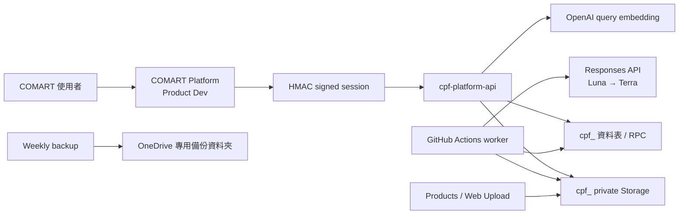

# COMART Product Finder

COMART 內部產品／文件搜尋系統，現已整合於 COMART Platform 的
`/product_dev/finder/`。前端是 React + TypeScript + Vite + Tailwind；
登入沿用 Platform 簽發的 HMAC session，資料、RLS、Storage 與 RPC 使用既有 Supabase Project；
文件解析與 AI 抽取由 GitHub Actions 每 5 分鐘執行。

目前可在無憑證的 Demo Mode 完整瀏覽介面。正式連線、migration、匯入與部署
需要下方列出的帳號／密鑰；這些值不得提交到 Git。

## 已實作範圍

- 共用 COMART Platform 單一登入；`user / dcc / admin` 對應
  `viewer / editor / admin`，前端不持有 service-role key。
- 查詢者／編輯者／管理員三角色，以及高度機密逐文件授權／撤銷。
- 產品與文件分離、多對多來源、版本、規格、報價階梯、欄位證據、廠商別名、
  審核、疑似重複、軟刪除、稽核及 90 天搜尋紀錄。
- 型號精確優先，再融合全文、模糊字串與 `text-embedding-3-large` 語意排名。
- JPG/JPEG/PNG/PDF/PPT/PPTX/XLS/XLSX/DOC/DOCX 深度解析。
- CAD、STEP、影片只建立 metadata；超過 100 MB 或 100 頁／投影片同樣只索引
  metadata 與下載入口。
- Office 由 LibreOffice 轉預覽 PDF；PDF 由 Poppler 產生頁面影像。
- Luna 常規抽取；低信心、多產品、廠商推定或衝突案例升級 Terra。
- AI Structured Outputs、`store:false`、提示／模型／用量紀錄。
- AI 只裁切來源中真實存在的產品影像；沒有可靠來源圖時顯示 placeholder。
- 所有原檔、預覽與縮圖位於 private buckets；前端只取得 60 秒下載或 5 分鐘
  預覽 signed URL。
- 目錄 SHA-256 去重、路徑追蹤、內容變更建立新版本、來源消失標記。
- GitHub Pages、5 分鐘 worker、CI 與每週 OneDrive 備份 workflows。

## 架構



GitHub Pages 網址仍是公開入口；安全邊界在 Supabase Auth、RLS 與 signed URL，
不是 repository 可見性。Private repository 發布 Pages 的帳號方案須符合
[GitHub Pages 文件](https://docs.github.com/en/pages/getting-started-with-github-pages)。

## 本機查看

macOS 可直接雙擊專案根目錄的 `啟動網站.command`。終端機視窗需保持開啟；
關閉終端機即停止本機網站。不要直接雙擊 `index.html`。

或在終端機執行：

```bash
npm install
npm run dev
```

正式 Platform 建置：

```bash
npm run build:platform
rsync -a --delete dist/ ../finder/
```

一般 `npm run dev` 未帶 Platform session 時會顯示返回 Platform 的單一登入提示。

驗證：

```bash
npm run typecheck
npm run lint
npm test
npm run build
worker/.venv/bin/pytest -q worker
python3 worker/import_directory.py --root .. --limit 20
```

最後一行是 dry-run，不會上傳。

## 正式上線前置資料

| 項目 | 用途 |
|---|---|
| 既有 Supabase project ref／URL | link project、套 migrations、部署 functions |
| Supabase anon key | GitHub Pages 前端公開設定；仍受 RLS 保護 |
| Supabase service-role key | worker／備份 secret，絕不可使用 `VITE_` 前綴 |
| Supabase DB URL | schema backup 與 migration 驗證 |
| GitHub owner、private repo 名稱與方案 | 建 repo、Secrets／Variables、Pages |
| 公司 OpenAI Project key | Responses API 與 embeddings |
| 備援管理員 Email | owner 以外的復原管道 |
| OneDrive 備份資料夾 | 每週單向備份目的地 |
| 最小權限 rclone config | 只寫入指定 OneDrive 備份資料夾 |

## Supabase 設定

1. 複製 `.env.example` 為 `.env.local`，只填本機需要的值。
2. 連結既有 project，先用 staging／branch 驗證：

   ```bash
   supabase link --project-ref YOUR_PROJECT_REF
   supabase db lint --linked
   supabase db push --dry-run
   supabase db push
   ```

3. 部署 functions：

   ```bash
   supabase functions deploy cpf-search
   supabase functions deploy cpf-file-url
   supabase functions deploy cpf-admin-user
   supabase secrets set OPENAI_API_KEY=...
   ```

   `cpf-download` 是相容用的單一下載 function；正式前端使用
   `cpf-file-url`。

4. 在 Supabase Auth 關閉公開註冊，設定 GitHub Pages Site URL／Redirect URL，
   並在方案支援時把 time-boxed session 設為 7 天。
5. 先從 Supabase Dashboard 邀請 Woody，再用 SQL Editor 建立第一位管理員：

   ```sql
   insert into public.cpf_profiles(id, email, display_name, role, active)
   select id, email, 'Woody', 'admin', true
   from auth.users
   where lower(email) = lower('WOODY_EMAIL@comart.com.tw')
   on conflict (id) do update
   set role = 'admin', active = true;
   ```

6. 由前台管理頁邀請備援管理員與其他使用者。

所有新物件都有 `cpf_` 前綴；Storage buckets 為 `cpf_source`、
`cpf_preview`、`cpf_thumbnail`。Migration 不會改動既有非 `cpf_` 表。

## GitHub 設定

Repository Variables：

- `VITE_SUPABASE_URL`
- `VITE_SUPABASE_ANON_KEY`
- `ONEDRIVE_BACKUP_PATH`

Repository Secrets：

- `SUPABASE_URL`
- `SUPABASE_SERVICE_ROLE_KEY`
- `SUPABASE_DB_URL`
- `OPENAI_API_KEY`
- `RCLONE_CONFIG_B64`

Pages Source 選 `GitHub Actions`。`worker.yml` 也可由管理員手動立即執行。
如果 Actions 分鐘數不足，先停批次並回報；本專案沒有加入 Railway 或其他
未核准的執行環境。

## 首次匯入

先看清單與容量：

```bash
python3 worker/import_directory.py --root .. --limit 20
```

小批正式上傳：

```bash
SUPABASE_URL=... SUPABASE_SERVICE_ROLE_KEY=... \
worker/.venv/bin/python worker/import_directory.py \
  --root .. --execute --limit 50
```

確認 50 檔試點後，才移除 `--limit`。要在一次完整掃描後標記已消失來源，
另外加入 `--mark-missing`；它只標記，不刪除原檔或產品。

## 黃金測試集

候選清單在 `golden-set/candidates.csv`。Woody 填完預期欄位並將
`woody_confirmed=true` 後執行：

```bash
SUPABASE_URL=... SUPABASE_SERVICE_ROLE_KEY=... OPENAI_API_KEY=... \
worker/.venv/bin/python worker/evaluate_golden.py \
  --manifest golden-set/candidates.csv
```

腳本用退出碼強制門檻：型號 90%、類別 90%、廠商 85%、代表查詢 Top-5
90%。未達標不得全量匯入。

樣本 `三合一桌面无线充20260629R.pdf` 已確認為兩頁：ID-001A、ID-001B、
193 × 61 × 11 mm，且同頁有二合一／三合一差異。這會觸發多產品 Terra
複核與人工拆分審核；文件沒有可靠廠商證據，因此系統不會自動建立廠商關聯。

## 備份與保留

- DB schema 與所有 `cpf_` metadata 每週匯出。
- 三個 private Storage buckets 每週單向複製到 OneDrive。
- Supabase DB backup 不包含 Storage 實際物件，不能拿 DB backup 代替此流程；
  參考 [Supabase 備份文件](https://supabase.com/docs/guides/platform/backups)。
- 搜尋／點擊明細 90 天後由 `cpf_purge_expired_search_events()` 清除。
- 軟刪除 30 天後仍不自動永久刪除，須管理員明確執行。

## AI 資料處理

工作器使用 OpenAI Responses API Structured Outputs，並設定 `store:false`。
原檔只在 runner 暫存目錄存在於處理期間，工作結束即刪除；資料庫只保留抽取
結果、證據、模型、提示版本與用量。模型分層遵循
[OpenAI 最新模型指引](https://developers.openai.com/api/docs/guides/latest-model)。

## 已知上線阻擋

這份 repository 目前未連到任何真實 Supabase／OpenAI／GitHub／OneDrive
帳號，因此沒有套用遠端 migration、沒有上傳 4.94 GiB 原檔、沒有呼叫
Responses API、沒有建立 GitHub repository，也沒有公開部署。這是刻意的：
缺少上述 owner、project ref、keys 與備援管理員決策時，不應猜測或把資料送到
錯誤帳號。
